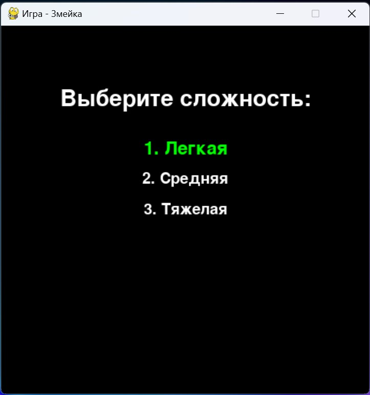
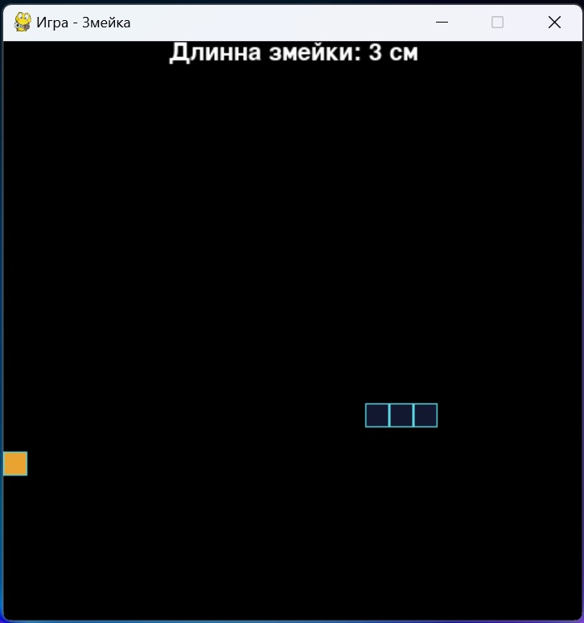
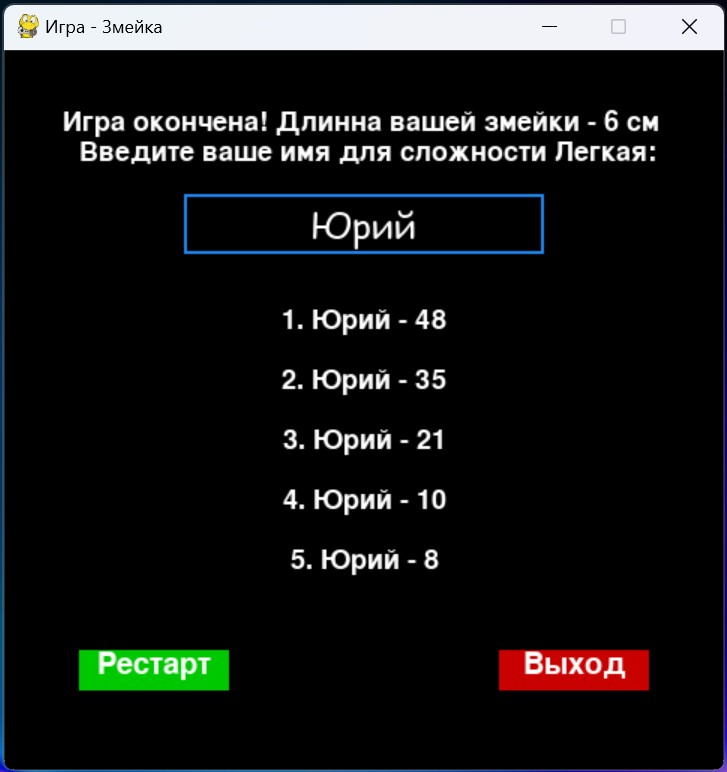

# Игра "Змейка" на Python

## Описание
Эта программа реализует классическую игру "Змейка" с использованием библиотеки Pygame. Игрок управляет змейкой, которая двигается по экрану и должна съесть еду для увеличения своей длины. Игра заканчивается, когда змейка сталкивается с собственным телом.

## Требования
- Python 3.6 или выше
- Pygame

## Установка

### Шаг 1: Клонирование репозитория
Клонируйте репозиторий на ваш локальный компьютер с помощью следующей команды:
```
git clone https://github.com/YSLMAYOY/Game_Snake.git
```

### Шаг 2: Установка Pygame
Перейдите в каталог проекта и установите необходимые библиотеки:
```
cd path-to-cloned-folder
pip install pygame
```

## Запуск игры
Для запуска игры выполните следующую команду в терминале или командной строке:
```
python snake_game.py
```
где `snake_game.py` — это имя файла скрипта.

## Основные компоненты

### Классы
- `Snake`: Управляет движением, ростом и отображением змейки.
- `Food`: Управляет появлением и отображением еды на игровом поле.
- `Game`: Управляет игровым процессом, включая начало, окончание и обновление состояния игры.

### Функциональность
- Управление змейкой с помощью клавиш со стрелками.
- Автоматическое появление пищи в случайных местах.
- Подсчет очков на основе длины змейки.
- Сохранение результатов в файл `high_scores.json` и отображение рекордов.

## Скриншоты
- Главный экран: 
- Экран игры: 
- Финальный экран: 

## Разработчик игры - `Харитонов Ю.С.`
